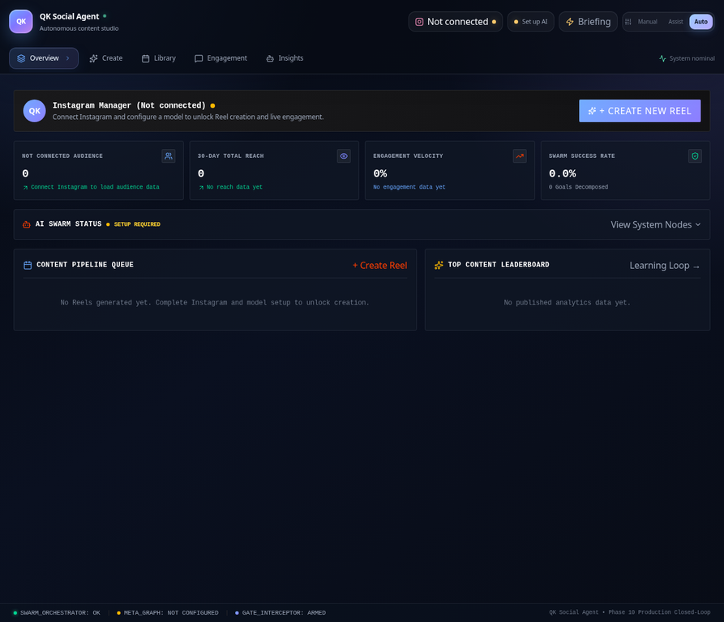
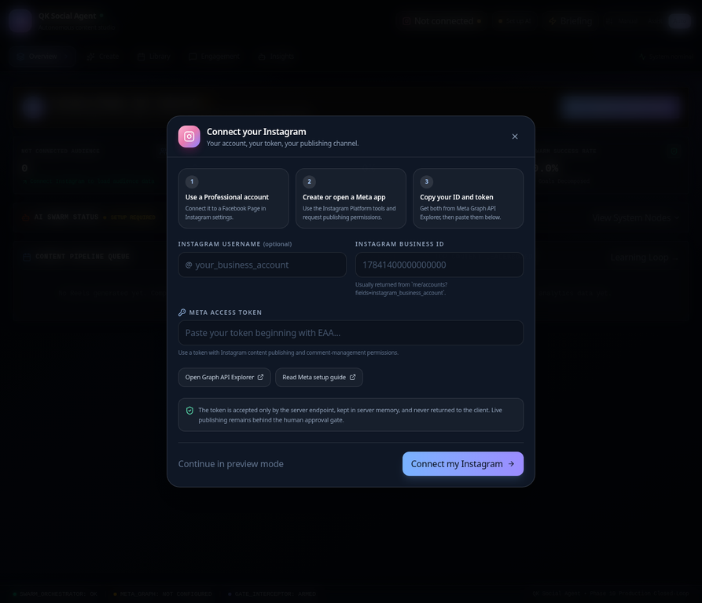
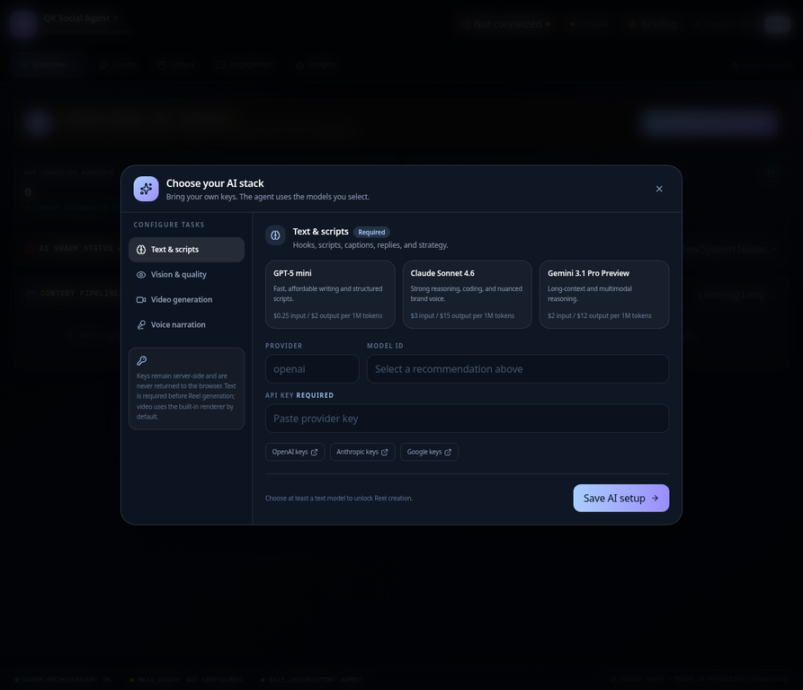

# QK Social Agent

> A review-first social media operations studio for creating, rendering, scheduling, publishing, and learning from short-form video content.

QK Social Agent is a full-stack TypeScript application for Instagram Reel workflows. It combines goal-driven content planning, model-assisted script generation, real MP4 rendering, human approval, Meta publishing, comment retrieval, public comment replies, and performance learning in one controlled workspace.

The product is intentionally **zero-demo and setup-gated**. It does not pretend that a shared account is connected, it does not seed fake follower or engagement numbers, and it does not generate fallback content when the selected model is unavailable. Users connect their own Instagram Professional account and configure their own model provider before content creation is unlocked.

## Product preview

### Zero-state dashboard



The dashboard shows the real connection state, zero metrics before data exists, the approval gate status, and clear setup actions instead of fabricated activity.

### Instagram account onboarding



The onboarding flow requests the user’s own Instagram Business Account ID and Meta access token, explains the required setup path, and links to the relevant Meta tools and documentation.

### AI model setup



The model setup panel presents recommended options for text, vision, video, and voice tasks. At least one text model is required before Reel creation can begin.

## Core capabilities

| Capability | Description |
| --- | --- |
| **Instagram onboarding** | Collects and verifies the user’s Instagram Professional/Business Account ID and Meta access token against the Meta Graph API. |
| **Model configuration** | Accepts user-owned provider keys and selected model IDs through a server-side setup flow. Keys are not returned to the browser. |
| **Strategy generation** | Converts a natural-language goal into a structured content strategy using the selected text model. |
| **Reel scripting** | Generates hooks, alternate hooks, timed scenes, voiceover copy, overlay text, captions, and hashtags. |
| **Real MP4 rendering** | Renders 9:16 H.264/AAC MP4 videos with FFmpeg at 1080×1920. |
| **Pre-publish review** | Provides a playable video review inside the approval modal and requires an explicit review confirmation before scheduling or publishing. |
| **Meta publishing** | Creates a Reel container, polls processing status, and publishes only after Meta reports `FINISHED`. |
| **Comment operations** | Loads live comments and can generate and post public replies through Meta’s comment-reply endpoint. |
| **Learning loop** | Runs model-assisted analysis of real published performance and stores new learnings only after the workflow is executed. |
| **Zero-data behavior** | Starts with empty Reels, learnings, experiments, traces, follower counts, reach, engagement, and agent load. |

## Workflow

```text
Connect Instagram account
        ↓
Configure text model and API key
        ↓
Enter a Reel goal
        ↓
Strategy and script generation
        ↓
Quality-control audit
        ↓
Real MP4 rendering
        ↓
Play and review the exact rendered video
        ↓
Approve and schedule or publish now
        ↓
Retrieve comments and send public replies
        ↓
Analyze real performance and update learnings
```

The workflow has two independent safety layers. The UI disables the generation action until setup is complete, and the server independently returns `428 Precondition Required` if a request attempts to bypass the setup gate.

## Getting started

### Requirements

Install Node.js, npm, and FFmpeg. A public HTTPS URL is required for live Meta publishing because Meta must download the rendered MP4 from the application server. Localhost is sufficient for development and preview only.

### Install and run

```bash
git clone https://github.com/Quaid-khan/qk-social-agent-.git
cd qk-social-agent-
npm install
npm run lint
npm run build
npm run dev
```

Open `http://localhost:3000` in a browser. The production server can be started with:

```bash
npm run start
```

### First-run configuration

The application opens with **Not connected** and zero data. Complete the following steps in order:

1. Connect an Instagram Professional/Business account. The account must be associated with a Facebook Page and the Meta app/token must have the permissions required for publishing and comment management.
2. Enter the Instagram Business Account ID and Meta access token. The server verifies the account before marking it connected.
3. Open **Set up AI** and select a provider, model ID, and API key for text generation. This is the minimum model configuration required to create Reels.
4. Optionally configure separate vision, video, or voice providers. The built-in FFmpeg renderer can create the Reel MP4 without an external video-generation key.
5. Open **Create** and submit a goal. The generated Reel will remain behind the human approval gate until reviewed.

Useful official resources include the [Meta Graph API Explorer](https://developers.facebook.com/tools/explorer/), [Instagram Platform documentation](https://developers.facebook.com/documentation/instagram-platform/), [OpenAI API keys](https://platform.openai.com/api-keys), [Anthropic API keys](https://console.anthropic.com/settings/keys), and [Google AI Studio keys](https://aistudio.google.com/app/apikey).

## Model recommendations

The setup panel provides three recommendations for each task. The text model is used for strategy, scripts, quality-control JSON, learning analysis, and generated comment replies. Provider pricing changes over time, so the values shown in the UI are guidance rather than a billing guarantee.

| Task | Recommended options | Best use |
| --- | --- | --- |
| **Text and scripts** | GPT-5 mini; Claude Sonnet 4.6; Gemini 3.1 Pro Preview | Fast writing, nuanced reasoning, or long-context multimodal work. |
| **Vision and quality control** | Gemini 3 Flash Preview; GPT-5; Claude Sonnet 4.6 | Fast visual checks, advanced visual reasoning, or balanced analysis. |
| **Video** | Built-in FFmpeg renderer; Google Veo; Runway models | Immediate local MP4 rendering or optional external generative-video integrations. |
| **Voice** | OpenAI TTS; Google Cloud TTS; ElevenLabs | Reliable narration, broad language coverage, or expressive creator voice. |

The live recommendation matrix is also documented in [`docs/models.md`](docs/models.md).

## Instagram publishing configuration

For live publishing, configure a public HTTPS `APP_URL`. The rendered file is served at:

```text
https://your-domain.example/api/media/<reel-id>.mp4
```

The Meta publishing sequence is:

1. Create an Instagram `REELS` media container with the public `video_url`.
2. Poll the container’s `status_code` until it reaches `FINISHED`.
3. Call `media_publish` with the completed container ID.
4. Record the returned Instagram media ID only when the publish request succeeds.

The application does not mark a Reel as live when the Meta request fails. See [`docs/instagram.md`](docs/instagram.md) for the detailed integration notes.

## API surface

| Endpoint | Purpose |
| --- | --- |
| `GET /api/health` | Reports server status, configured model status, autonomy level, and account connection state. |
| `GET /api/dashboard` | Returns telemetry, Reels, learnings, experiments, traces, and current agent state. |
| `GET /api/settings/models` | Returns safe model readiness, selected model metadata, and recommendations without API keys. |
| `POST /api/settings/models` | Stores selected provider/model/API-key settings in server memory. |
| `POST /api/settings/account` | Verifies and links the user’s Instagram account. |
| `POST /api/orchestrator/run-goal` | Starts Reel generation after the account/model setup gate passes. |
| `GET /api/media/:id.mp4` | Serves a generated MP4 to the browser and Meta. |
| `POST /api/reels/:id/approval` | Approves, schedules, rejects, or publishes a Reel. |
| `GET /api/engagement/comments` | Retrieves comments from published media. |
| `POST /api/engagement/reply` | Generates and/or posts a public comment reply. |
| `POST /api/tests/run-all` | Runs configuration and integration readiness checks. |

## Security and operational notes

API keys and Meta tokens are accepted by server endpoints and are not returned to the client. In the current single-process implementation, credentials are held in server memory; they are lost when the process restarts and should be replaced with a managed secret store for a permanent deployment. Never commit `.env` files, access tokens, or provider keys to the repository.

Human approval remains mandatory before scheduling or publishing. The preview modal plays the exact rendered MP4 and requires the operator to confirm that the video was reviewed. Publishing also requires a publicly reachable video URL and valid Meta permissions.

## Validation

The repository currently passes the following quality checks:

```bash
npm run lint
git diff --check
npm run build
```

The local integration validation covers real MP4 creation, media serving, setup gating, Meta container polling with a deterministic test stub, comment retrieval, and comment reply behavior. Live Instagram publishing still requires the user’s own valid credentials and account permissions.

## Project structure

```text
src/
  components/       Dashboard, onboarding, model setup, Reel review, engagement, and analytics UI
  App.tsx           Application state, API wiring, setup gates, and modal orchestration
  types.ts          Shared frontend types
server.ts           Express API, model adapters, FFmpeg rendering, Meta integration, and in-memory state
docs/
  instagram.md      Meta publishing and comment integration notes
  models.md         Model recommendation matrix and catalog basis
  assets/           README screenshots
```

## License and ownership

This repository is maintained by the project owner. Review each provider’s terms, usage limits, and data-processing requirements before enabling live automation.
